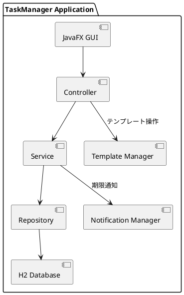
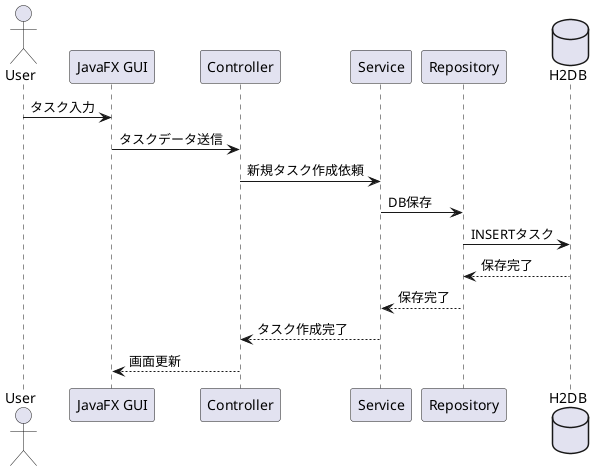

# 全体設計（システム構成）

## 1. システム構成概要
- ローカル完結型デスクトップアプリ  
- フロントエンド：JavaFX  
- バックエンド：Spring Boot (Controller / Service / Repository)  
- DB：H2DB（ローカルファイル）  
- 実行形式：exe（Windows 10 / 11）

## 2. アーキテクチャ構成
- JavaFX GUI → Controller → Service → Repository → H2 Database  
- Notification Manager：期限通知  
- Template Manager：タスクテンプレート操作

## 3. データフロー
1. タスク作成：GUI → Controller → Service → Repository → DB  
2. タスク表示：Controller → Service → DB → GUI  
3. タスク更新／削除：GUI → Controller → Service → Repository → DB  
4. 期限通知：Notification Manager → Service → GUI  
5. テンプレート利用：Template Manager → Service → 新規タスク作成  

## 4. 利用技術一覧
| 層 | 技術 / フレームワーク |
|----|--------------------|
| GUI | JavaFX |
| Controller / Service / Repository | Spring Boot 2.5.10 |
| DB | H2 Database (ローカルファイル) |
| ビルド / 依存管理 | Maven |
| 配布 | exe (jpackage など) |

## 5. シーケンス図（タスク作成例）

---

## 6. 注意点
- データフローはローカル完結  
- GUI → Service → Repository は同期処理  
- 将来的なサーバー化も想定
