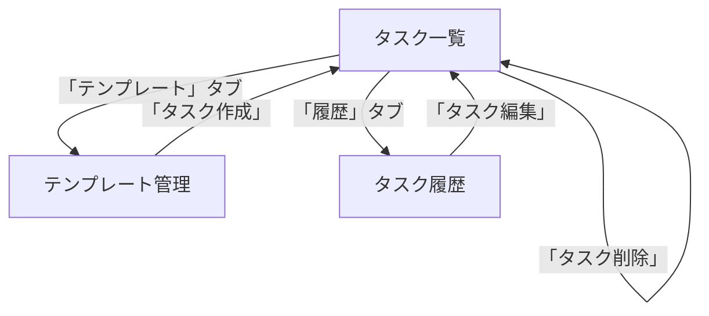
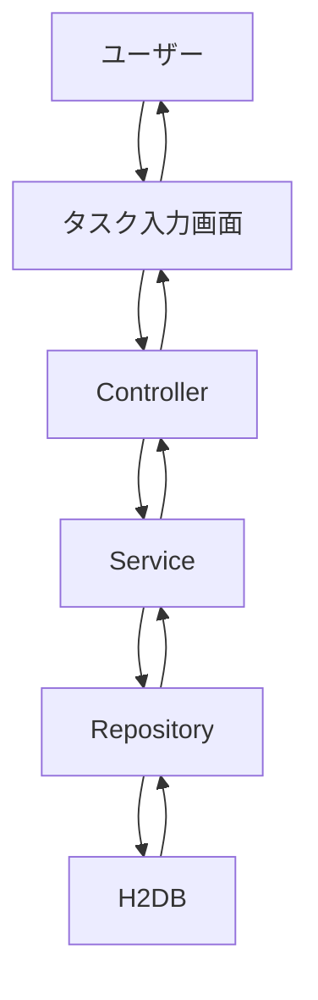

# 機能設計

## 1. タスク管理
- 追加 / 編集 / 削除  
- 完了管理  
- 並べ替え（ドラッグ＆ドロップ）  
- 検索・フィルタ  

## 2. 期限・通知
- 期限設定（日時）  
- 期限前通知（ポップアップ）  

## 3. カテゴリ・優先度管理
- カテゴリ設定（例：仕事・学習・プライベート）  
- 優先度設定（高・中・低）  

## 4. テンプレート機能
- テンプレート登録 / 編集 / 削除  
- テンプレートからタスク作成  

## 5. タスク履歴・分析
- 完了タスク履歴  
- 日別・週別完了タスク数  
- グラフ表示（棒・円グラフ）  

## 6. データ管理
- H2DB にローカル保存  
- 自動保存  
- CSV 形式でエクスポート／インポート

## 7. 画面遷移図

## 7. 操作フロー図（タスク追加例）

