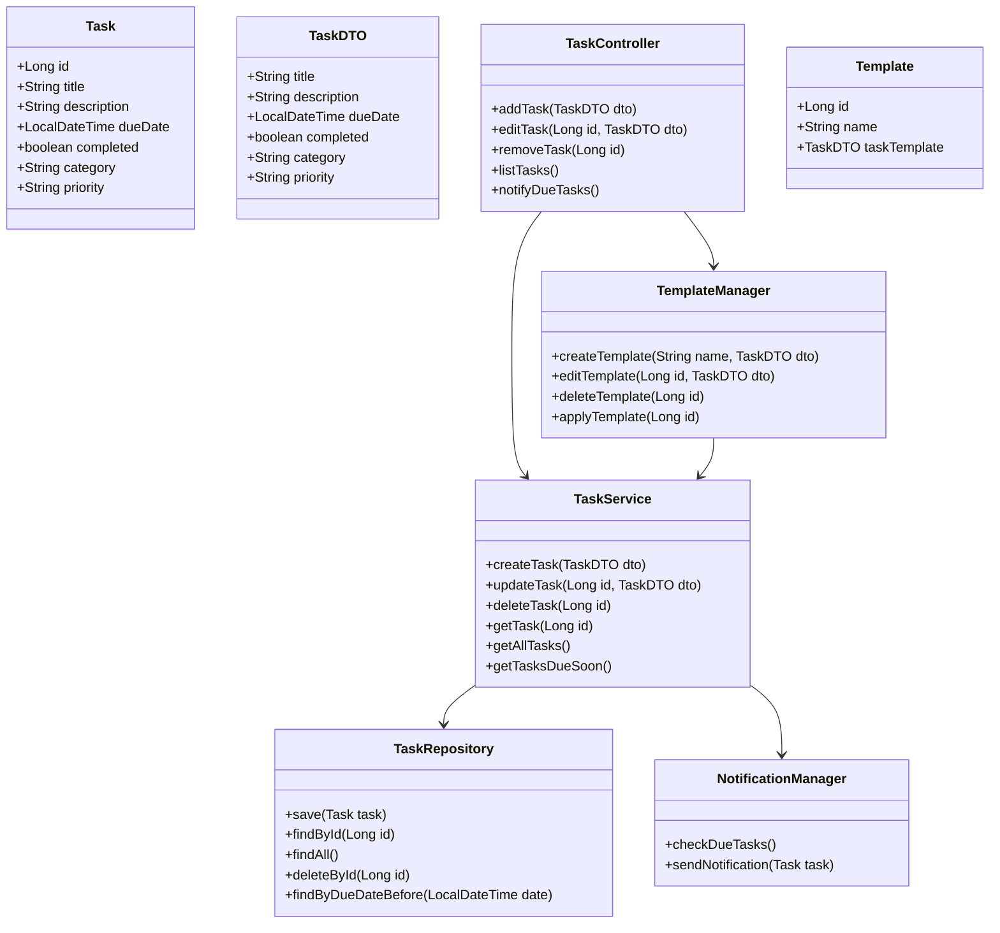

# TaskHelper クラス設計

## 1. クラス図（Mermaid）

## 2. 説明

- **Entity / DTO**
  - `Task`：H2DB に保存されるタスクエンティティ  
  - `TaskDTO`：GUI から Service へのデータ受け渡し用  

- **Repository**
  - `TaskRepository`：DB への CRUD 操作を担当  
  - 例：`save()`, `findById()`, `findAll()`, `deleteById()`  

- **Service**
  - `TaskService`：ビジネスロジックを担当  
  - 例：タスク作成・更新・削除、期限チェック、期限通知用タスク取得  

- **Controller**
  - `TaskController`：GUI からの操作を受けて Service を呼び出す  
  - 例：`addTask()`, `editTask()`, `removeTask()`, `listTasks()`, `notifyDueTasks()`  

- **TemplateManager**
  - タスクテンプレート管理を担当  
  - テンプレート作成・編集・削除・適用  

- **NotificationManager**
  - 期限通知を担当  
  - タスクの期限が近い場合に GUI へ通知を送信  

- **関連**
  - `TaskController` → `TaskService` → `TaskRepository`  
  - `TaskService` → `NotificationManager`  
  - `TaskController` → `TemplateManager` → `TaskService`  
