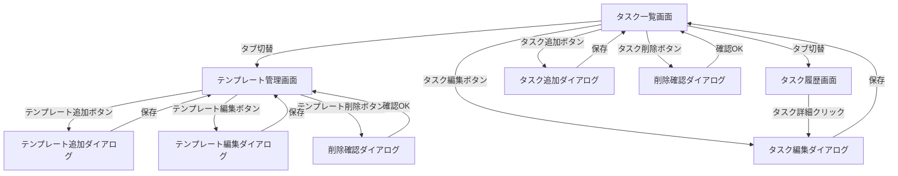

# TaskHelper 画面レイアウト設計

## 1. メイン画面

## 2. 画面要素一覧

### タスク一覧画面
- タスクテーブル（タイトル、期限、優先度、カテゴリ、完了状態）
- タスク追加・編集・削除ボタン
- 並べ替え（ドラッグ＆ドロップ）
- 検索・フィルタ機能
- タブ：テンプレート / 履歴

### テンプレート管理画面
- テンプレート一覧テーブル
- テンプレート追加・編集・削除ボタン

### タスク履歴画面
- 完了タスク一覧テーブル
- タスク詳細表示
