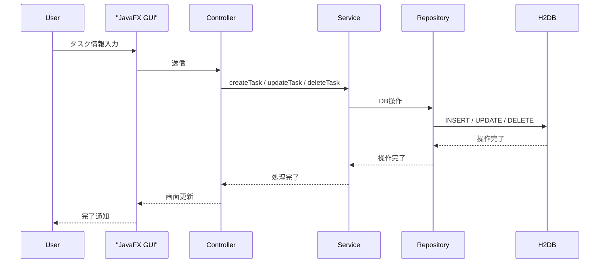
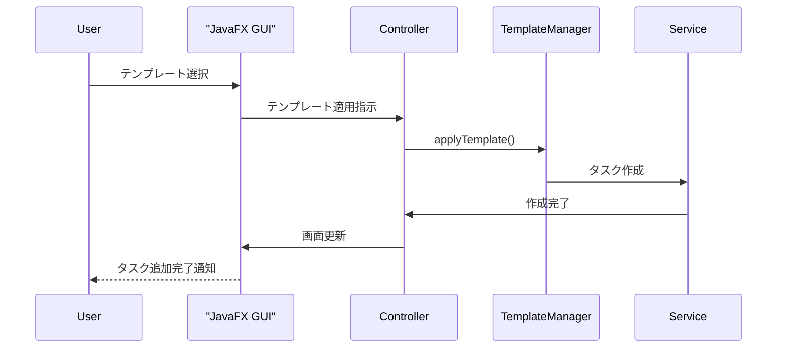
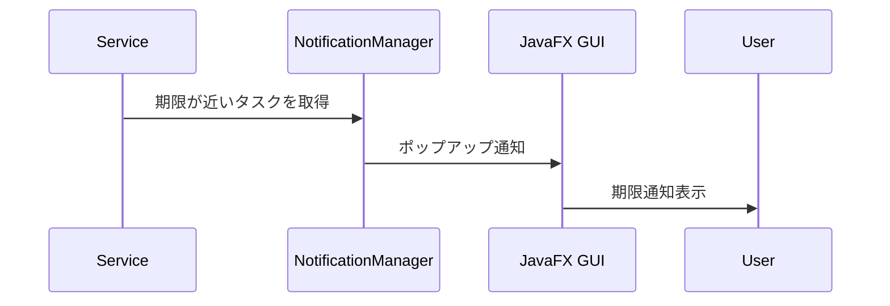

# TaskHelper 操作フロー設計

## 1. タスク追加・編集・削除

```mermaid
sequenceDiagram
    participant User
    participant GUI as "JavaFX GUI"
    participant Ctrl as Controller
    participant Svc as Service
    participant Repo as Repository
    participant DB as H2DB

    User->>GUI: タスク情報入力
    GUI->>Ctrl: 送信
    Ctrl->>Svc: createTask / updateTask / deleteTask
    Svc->>Repo: DB操作
    Repo->>DB: INSERT / UPDATE / DELETE
    DB-->>Repo: 操作完了
    Repo-->>Svc: 操作完了
    Svc-->>Ctrl: 処理完了
    Ctrl-->>GUI: 画面更新
    GUI-->>User: 完了通知
```

## 2. テンプレート利用

```mermaid
sequenceDiagram
    participant User
    participant GUI as "JavaFX GUI"
    participant Ctrl as Controller
    participant TM as TemplateManager
    participant Svc as Service

    User->>GUI: テンプレート選択
    GUI->>Ctrl: テンプレート適用指示
    Ctrl->>TM: applyTemplate()
    TM->>Svc: タスク作成
    Svc->>Ctrl: 作成完了
    Ctrl->>GUI: 画面更新
    GUI-->>User: タスク追加完了通知
```

## 3. 期限通知フロー

```mermaid
sequenceDiagram
    participant Svc as Service
    participant NM as NotificationManager
    participant GUI as JavaFX GUI
    participant User

    Svc->>NM: 期限が近いタスクを取得
    NM->>GUI: ポップアップ通知
    GUI->>User: 期限通知表示
```
